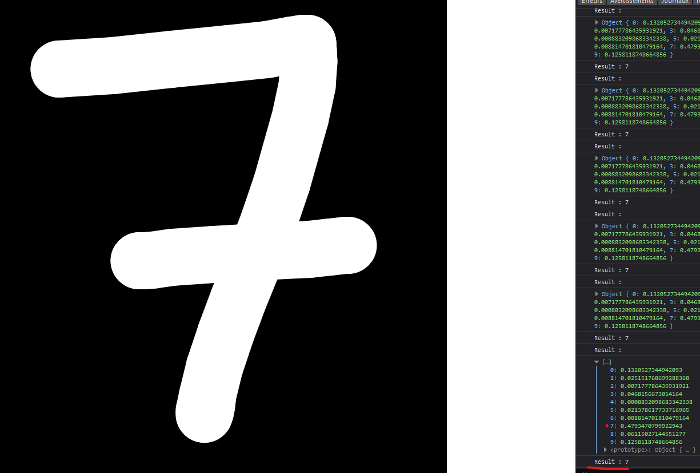

# alpha-numeric-recognition

## Content

* imageGenerator
  
  Language : Java using the Processing3 lib.\
  Utility : Make some datasets of image fast (900x900 image that is pre-processed and reduced around 20x20).\
  Usage : 
  * Drag with left click to draw.
  * press "M" (on azerty keyboard) to change mode : HightQuality (HQ) or LowQuality (LQ).
  * press an other key (like "space") to save the image in "./out" (HQ version) and "./out-min" (LQ version).\
  
  Ps : use processing to run it

* dataLister
  
  Language : Bash\
  Utility : List the available dataset of image and write it into "data.js".\
  Usage : \
  ```./dataLister/run.sh [data-set-folder]```\
  Example : \
  ```./dataLister/run.sh ./imageGenerator/out```

* web
  
  Language : HTML, CSS, JavaScript using the p5.js brain.js libs.\
  Utility : Contains the web files to load the Artificial Neural Network, train it, and test it.\
  Usage (do it on root, outside the web folder) :\
  ```serve -s ./```

* data
  
  Utility : Not in the gitignore to have some example datasets.

## Usage

On root : \
```serve -s ./```

On your Navigator, go to (open the console before, for now, it's a bit laggy) :\
```http://localhost:5000```

## Example :

Take this image of the number 5 (900x900 pixels) :\


With the p5 library, we preprocess this image into a smaller image size such as 20x20 :\


Now we have a small image that can be represented as a 2D array of pixels, or even better, a 2D array of binary values (0: black, 1: white).\
Thus, by sending this array to the input of a neural network network trained with a bunch of images, we can get the number that is drawn as the result :\

